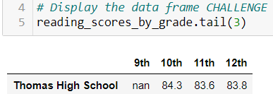

# School District Analysis

## Overview of the School District Analysis
The purpose of this project is to assist Maria, a Data Scientist at the City School District in analyzing standardized test scores and study trends. The school board has notified Maria and her supervisor that the current [student_complete.csv](https://github.com/nguyencao247/School_District_Analysis/blob/main/Resources/students_complete.csv) file shows evidence of academic dishonesty. Specifically the reading and math scores for Thomas High School ninth graders appear to have been altered. In order to provide an accurate analysis of the district’s scores, Maria has removed those scores from her analysis. We will then use this data to help the school board and superintendent make decisions regarding school budgets and other priorities. The original analysis was done using [PyCitySchools.ipynb](https://github.com/nguyencao247/School_District_Analysis/blob/main/PyCitySchools.ipynb), while the new analysis with ninth graders from Thomas High School's student's scores removed were done in [PyCitySchools_Challenge.ipynb](https://github.com/nguyencao247/School_District_Analysis/blob/main/PyCitySchools_Challenge.ipynb).

## Results: 
- How is the district summary affected?
  - All score metrics were affected by 0.1 point or 0.1% - 0.3%, with the exception of the average reading score for the district.
  
  Original District Summmary:
  

  Challenge District Summary:
  

- How is the school summary affected?
  - The school summary for Thomas High School was significantly affected. The percentage of students who passed reading, math, and both subjects decreased by about 25% - 28%. This is inaccurate because the total count of students at Thomas High School has not been removed and recalculated yet. This drastic change is due to a large number (461) of ninth graders at Thomas High School without grades but were included in the school’s total student count, decreasing the passing percentages. 
  
  Original School Summmary:
  

  Challenge School Summary:
  

- How does replacing the ninth graders’ math and reading scores affect Thomas High School’s performance relative to the other schools?
  - There was no significant change. Thomas High School still kept their second place, as there was only a difference of 0.1% - 0.3% in the score percentages.
  
  Original Top Schools:
  

  Challenge Top Schools:
  

  
- How does replacing the ninth-grade scores affect the following:
  - Math and reading scores by grade: there was no effect on the upperclassmen’s scores as only the ninth grader’s scores were removed and the table is grouped by grades.
  
  Math Scores By Grade Original vs. Math Scores By Grade Challenge
  
 

  Reading Scores By Grade Original vs. Reading Scores By Grade Challenge
  
 

  
  - Scores by school spending: there was no effect. 
  
  Original Scores by Schools:
  

  Challenge Scores by Schools:
  

    
  
  - Scores by school size: there was no effect.
  
  Original Scores by School Size:
  

  Challenge Scores by School Size:
  

    
  
  - Scores by school type: there was no effect.
  
  Original Scores by School Types:
  

  Challenge Scores by School Types:
  

  

## Summary: 
After the reading and math scores for the ninth grade at Thomas High School have been replaced with NaNs, there were four major changes: (1) average math score [difference of 0.1 point), (2) percentage of students who passed math [difference of 0.2%], (3) percentage of students who passed reading [difference of 0.3%], and (4) the percentage of students who passed both subjects [difference of 0.1%].
